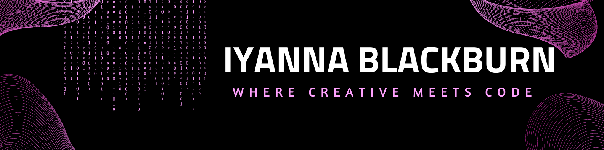

## Business & Portfolio Site
:hibiscus:[Alani Bay Studios](https://alanibaystudios.com/)

## First Ever Portfolio Site (Built From Scratch)
:sparkles:[Iyanna Develops](https://IyannaDevelops.netlify.app)

## Languages & Tools

**Programming Languages**\

**Data Science & Data Bases**\

**Developement**\

**Design**\

**Skills Hub**\

## About Me
:cherry_blossom: I am based in Southern California  
:seedling: I am currently analyzing data to explore how social media impacts digital well-being, behavior, and connection.   
:art: I love incorporating my creative side into my projects.   
:handshake: Currently accepting inquiries on project collaborations & job opportunities. \
:heartpulse: If Im not working on a project, I enjoy spending time with family and friends, building community, staying active, exploring new places, discovering vegan cuisine, and always finding something new to learn.   
:email: You can contact me through my Portfolio Site Contact Form.  
<!-- ## Stats

-->
<!--## Socials
](https://github.com/IyannaB623/github-readme-twitter)-->

## Support

  

<!--
**IyannaB623/IyannaB623** is a ✨ _special_ ✨ repository because its `README.md` (this file) appears on your GitHub profile.

Here are some ideas to get you started:

- 🔭 I’m currently working on ...
- 🌱 I’m currently learning ...
- 👯 I’m looking to collaborate on ...
- 🤔 I’m looking for help with ...
- 💬 Ask me about ...
- 📫 How to reach me: ...
- 😄 Pronouns: ...
- ⚡ Fun fact: ...
https://github.com/inttter/md-badges?tab=readme-ov-file#-design

-->
